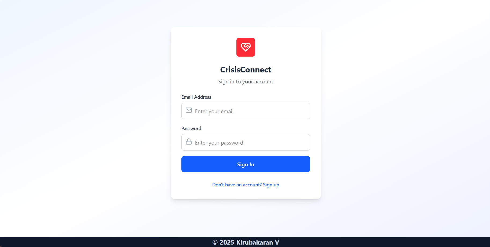
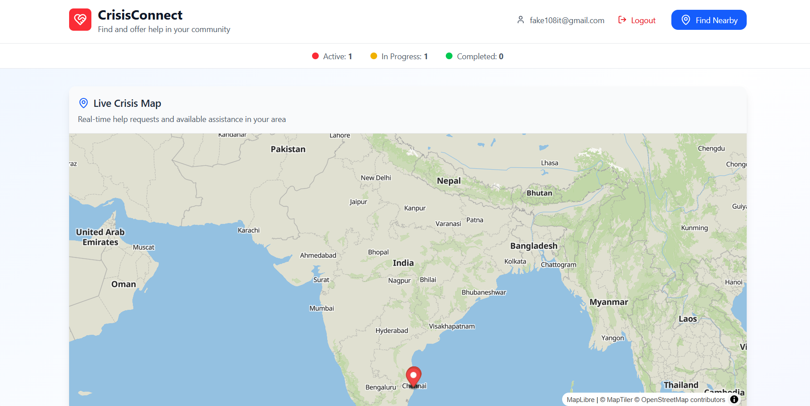
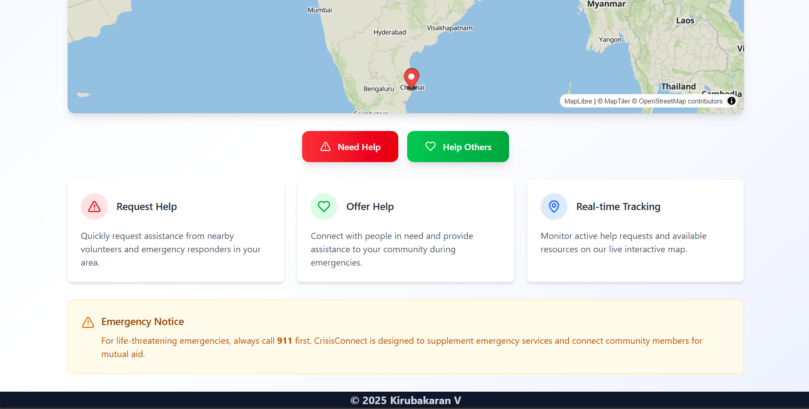
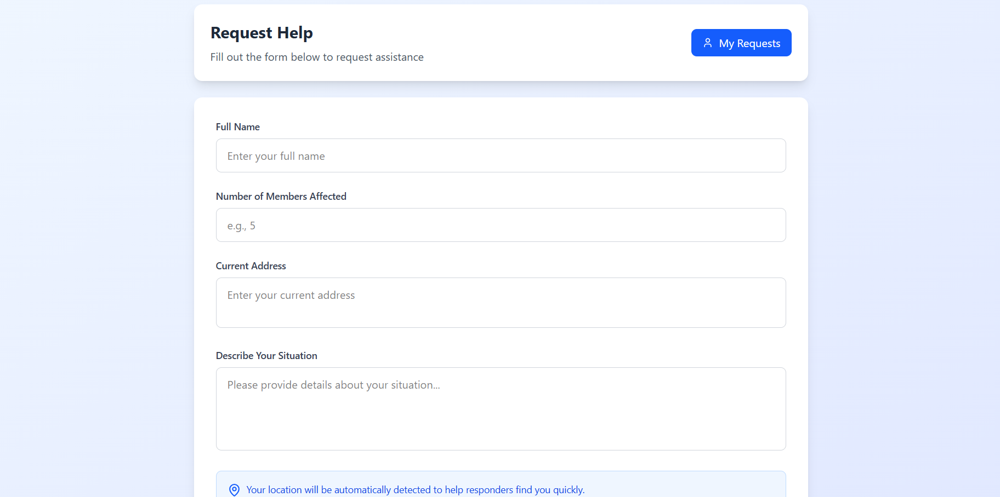
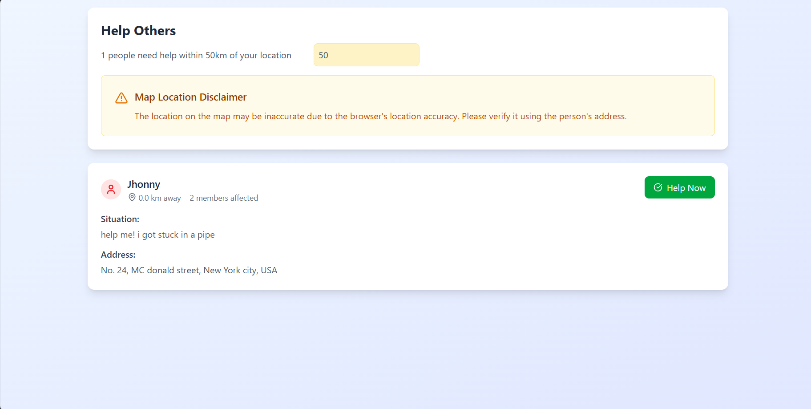

# CrisisConnect

CrisisConnect is a real-time community support platform designed to connect people in crisis with nearby volunteers who can provide assistance. The platform leverages interactive geolocation mapping to make it easy for users to request help and for volunteers to locate and respond to those requests efficiently.

## Key Features

- **Real-Time Assistance Requests:** Users in crisis can post help requests in real time, allowing for immediate visibility and response.
- **Volunteer Locator:** Volunteers can view and filter help requests based on their current geolocation, ensuring they see requests that are nearby and actionable.
- **Interactive Geolocation Mapping:** An integrated map (powered by MapTiler) displays help requests and volunteer locations, making coordination intuitive and efficient.
- **Dynamic Status Tracking:** Each assistance effort can be tracked and updated through a dynamic status system, keeping both users and volunteers informed of progress.
- **Community-Driven Support:** Fosters a sense of community by enabling users to both seek and offer help during critical moments.

## Technologies Used

- **Frontend:** ReactJS, TailwindCSS
- **Backend:** Node.js, Express.js
- **Mapping:** MapTiler
- **Database:** MongoDB
- **Authentication & Real-Time Updates:** Firebase
- **API Design:** REST API

# Screenshots

## Login Page

## Home Pages

## Request Form

## Help Others

